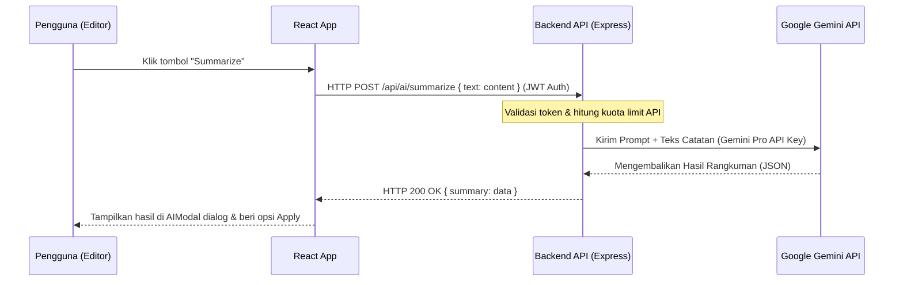

# DOKUMENTASI BACKEND & ARSITEKTUR DATABASE — NOTULA
**Spesifikasi Penyimpanan Data Lokal & Rencana Migrasi Arsitektur Server**

---

## 1. Penyimpanan Data Aktual (Local Storage)

Pada iterasi saat ini, Notula menggunakan arsitektur *offline-first client-side data layer* memanfaatkan **Web Storage API (LocalStorage)**. Keputusan ini diambil untuk menjamin respon penyimpanan instan (<8ms) tanpa dipengaruhi oleh latensi jaringan internet.

### A. Skema Struktur Catatan (`notula_notes`)
Data disimpan sebagai JSON Array dengan struktur objek sebagai berikut:

```json
[
  {
    "id": "string (timestamp unik)",
    "title": "string (judul catatan)",
    "content": "string (isi catatan dalam format Markdown)",
    "createdAt": "string (ISO 8601 DateTime)",
    "updatedAt": "string (ISO 8601 DateTime)",
    "aiTag": "string | null (e.g., 'AI Summarized')",
    "isFavorite": "boolean",
    "isArchived": "boolean",
    "notebook": "string (nama kategori folder)"
  }
]
```

### B. Skema Preferensi Sistem (`notula_settings`)
Preferensi user disimpan secara terpisah untuk memisahkan siklus pembaruan data:

```json
{
  "darkMode": "boolean",
  "autoSave": "boolean",
  "aiFeatures": "boolean"
}
```

---

## 2. Operasi Data Aktual (notesStore.js)

Logika manipulasi data dibungkus dalam modul [notesStore.js](file:///d:/TUGAS%20ITTP/SEMESTER%206/Kapita%20Selekta/UAS/tubes-kapita-selekta-kelompok2/Frontend/src/utils/notesStore.js). Fungsi-fungsi utama yang tersedia:
*   `getNotes()`: Mengembalikan catatan aktif (tidak diarsip) diurutkan berdasarkan tanggal pembaruan terbaru.
*   `createNote(notebook)`: Menginisialisasi draf catatan baru.
*   `saveNote(id, updates)`: Memperbarui isi catatan secara real-time.
*   `deleteNote(id)`: Menghapus catatan secara permanen dari array penyimpanan.
*   `toggleFavorite(id)` & `toggleArchive(id)`: Mengubah status bendera boolean penanda filter.

---

## 3. Rencana Migrasi Backend Server

Untuk meningkatkan skala aplikasi Notula ke dunia nyata, berikut adalah spesifikasi rancangan arsitektur server backend yang disusulkan:

### A. Rancangan REST API Endpoint (Express.js / Node.js)
Jika dihubungkan ke server database terpusat, berikut adalah API kontrak yang perlu dikembangkan:

| Metode | Endpoint | Proteksi Akses | Deskripsi |
| :--- | :--- | :---: | :--- |
| **POST** | `/api/auth/register` | Publik | Registrasi akun pengguna baru |
| **POST** | `/api/auth/login` | Publik | Login pengguna dan mengembalikan JWT Token |
| **GET** | `/api/notes` | Private (JWT) | Mengambil semua catatan pengguna aktif |
| **POST** | `/api/notes` | Private (JWT) | Membuat catatan baru |
| **PUT** | `/api/notes/:id` | Private (JWT) | Memperbarui judul/konten catatan |
| **DELETE**| `/api/notes/:id` | Private (JWT) | Menghapus catatan secara permanen |
| **POST** | `/api/ai/summarize` | Private (JWT) | Mengirimkan draf teks untuk dirangkum LLM |

### B. Integrasi Database Cloud menggunakan Supabase (Direkomendasikan)

Supabase adalah BaaS (Backend-as-a-Service) open-source berbasis PostgreSQL. Kita dapat memanfaatkannya untuk menggantikan `localStorage` secara langsung menggunakan client SDK tanpa perlu membangun server Express tersendiri.

#### 1. Struktur Tabel PostgreSQL di Supabase (`notes`)
Pengguna perlu mengeksekusi DDL berikut di SQL Editor Supabase untuk membuat tabel `notes` dengan validasi relasi pengguna (*User Association*):

```sql
-- Buat Tabel Catatan
create table public.notes (
  id uuid default gen_random_uuid() primary key,
  user_id uuid references auth.users(id) on delete cascade not null,
  title text default '' not null,
  content text default '' not null,
  created_at timestamp with time zone default timezone('utc'::text, now()) not null,
  updated_at timestamp with time zone default timezone('utc'::text, now()) not null,
  ai_tag text default null,
  is_favorite boolean default false not null,
  is_archived boolean default false not null,
  notebook text default '' not null
);

-- Aktifkan Row Level Security (RLS)
alter table public.notes enable row level security;

-- Buat Kebijakan RLS (User hanya bisa akses catatannya sendiri)
create policy "User can view their own notes"
  on public.notes for select
  using (auth.uid() = user_id);

create policy "User can insert their own notes"
  on public.notes for insert
  with check (auth.uid() = user_id);

create policy "User can update their own notes"
  on public.notes for update
  using (auth.uid() = user_id);

create policy "User can delete their own notes"
  on public.notes for delete
  using (auth.uid() = user_id);
```

#### 2. Klien Inisialisasi Supabase (`Frontend/src/utils/supabaseClient.js`)
Pustaka SDK Supabase dapat dipasang pada proyek frontend:
```bash
npm install @supabase/supabase-js
```
Kemudian diinisialisasi menggunakan file konfigurasi:
```javascript
import { createClient } from '@supabase/supabase-js'

const supabaseUrl = import.meta.env.VITE_SUPABASE_URL
const supabaseAnonKey = import.meta.env.VITE_SUPABASE_ANON_KEY

export const supabase = createClient(supabaseUrl, supabaseAnonKey)
```

#### 3. Pemetaan Fungsi CRUD Lokal ke Supabase SDK
Fungsi local-CRUD lama di `notesStore.js` akan digantikan dengan pemanggilan asinkron SDK Supabase:

*   **Mengambil Catatan (Read)**:
    ```javascript
    export async function getNotes() {
      const { data, error } = await supabase
        .from('notes')
        .select('*')
        .eq('is_archived', false)
        .order('updated_at', { ascending: false })
      if (error) throw error
      return data
    }
    ```
*   **Membuat Catatan (Create)**:
    ```javascript
    export async function createNote(notebook = '') {
      const { data: { user } } = await supabase.auth.getUser()
      const { data, error } = await supabase
        .from('notes')
        .insert([{ user_id: user.id, notebook }])
        .select()
        .single()
      if (error) throw error
      return data
    }
    ```
*   **Menyimpan Pembaruan (Update)**:
    ```javascript
    export async function saveNote(id, updates) {
      const { data, error } = await supabase
        .from('notes')
        .update({ ...updates, updated_at: new Date().toISOString() })
        .eq('id', id)
        .select()
        .single()
      if (error) throw error
      return data
    }
    ```
*   **Menghapus Catatan (Delete)**:
    ```javascript
    export async function deleteNote(id) {
      const { error } = await supabase
        .from('notes')
        .delete()
        .eq('id', id)
      if (error) throw error
    }
    ```
```

---

## 4. Alur Integrasi API AI (Google Gemini API)

Saat ini fitur AI disimulasikan secara lokal demi kepuasan prototipe visual (*visual simulation*). Ketika model backend diaktifkan, alur interaksi asisten AI dirancang seperti diagram di bawah ini:


