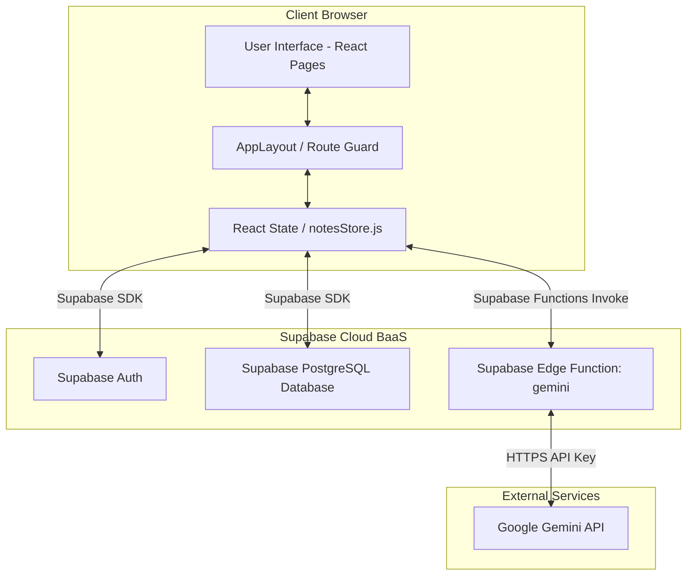

# DOKUMENTASI BACKEND & ARSITEKTUR DATABASE — NOTULA (SUPABASE SERVERLESS)
**Spesifikasi Penyimpanan Data, Otentikasi Supabase & Deployment Edge Functions**

---

## 1. Arsitektur Serverless
Notula menggunakan arsitektur **Serverless** terdistribusi yang didukung oleh **Supabase**. Seluruh logika otentikasi pengguna dan manipulasi data catatan diproses secara langsung di sisi klien menggunakan SDK resmi Supabase (`@supabase/supabase-js`), sedangkan modul kecerdasan buatan (AI) diproksi secara aman menggunakan **Supabase Edge Functions** untuk menjaga privasi API Key Gemini.



---

## 2. Autentikasi Pengguna (Supabase Auth)
Otentikasi ditangani secara terpusat oleh **Supabase Auth**. 
*   **Registrasi**: Menggunakan `supabase.auth.signUp()` yang otomatis meregistrasikan kredensial pengguna ke dalam skema internal `auth.users` Supabase serta menyimpan metadata nama lengkap (`fullName`).
*   **Masuk (Login)**: Menggunakan `supabase.auth.signInWithPassword()` yang memvalidasi kredensial dan menerbitkan sesi ber-token JWT yang disimpan secara otomatis oleh SDK di `localStorage` peramban.
*   **Proteksi Rute (Auth Guard)**: Dilakukan di komponen `AppLayout.jsx` dengan memanggil `supabase.auth.getSession()` sebelum memuat halaman sensitif (Dashboard, Editor, Profile) dan otomatis mengalihkan pengguna ke `/login` jika tidak ada sesi aktif.

---

## 3. Skema Database (Supabase PostgreSQL)
Data catatan pengguna disimpan dalam database PostgreSQL pada tabel `public.notes` dengan struktur sebagai berikut:

### Tabel `public.notes`
```sql
CREATE TABLE public.notes (
  id TEXT PRIMARY KEY,
  user_id UUID REFERENCES auth.users(id) ON DELETE CASCADE NOT NULL,
  title TEXT DEFAULT '' NOT NULL,
  content TEXT DEFAULT '' NOT NULL,
  ai_tag TEXT DEFAULT NULL,
  is_favorite BOOLEAN DEFAULT FALSE NOT NULL,
  is_archived BOOLEAN DEFAULT FALSE NOT NULL,
  notebook TEXT DEFAULT '' NOT NULL,
  created_at TIMESTAMP WITH TIME ZONE DEFAULT timezone('utc'::text, now()) NOT NULL,
  updated_at TIMESTAMP WITH TIME ZONE DEFAULT timezone('utc'::text, now()) NOT NULL
);
```

### Row Level Security (RLS) & Kebijakan
Supabase menerapkan keamanan baris tabel (RLS) untuk menjamin isolasi data antar pengguna sehingga pengguna hanya dapat berinteraksi dengan datanya sendiri:

```sql
-- 1. Aktifkan RLS
ALTER TABLE public.notes ENABLE ROW LEVEL SECURITY;

-- 2. Buat Kebijakan Keamanan
CREATE POLICY "Users can select their own notes" 
  ON public.notes FOR SELECT 
  USING (auth.uid() = user_id);

CREATE POLICY "Users can insert their own notes" 
  ON public.notes FOR INSERT 
  WITH CHECK (auth.uid() = user_id);

CREATE POLICY "Users can update their own notes" 
  ON public.notes FOR UPDATE 
  USING (auth.uid() = user_id);

CREATE POLICY "Users can delete their own notes" 
  ON public.notes FOR DELETE 
  USING (auth.uid() = user_id);
```

---

## 4. Supabase Edge Functions (Proksi AI Gemini)
Supabase Edge Function (`gemini`) didefinisikan dalam berkas `supabase/functions/gemini/index.ts` menggunakan lingkungan runtime Deno TypeScript.

### Fungsi Utama:
Fungsi ini bertindak sebagai proksi HTTP POST yang menerima teks catatan dari frontend klien, menyematkan API Key Gemini (`GEMINI_API_KEY`) yang disimpan secara aman di rahasia server (Supabase Secrets), memproses permintaan AI, dan mengembalikan hasilnya ke editor.

### Cara Deploy Edge Function:
1.  **Instal Supabase CLI** jika belum terpasang:
    ```bash
    npm install -g supabase
    ```
2.  **Login ke Akun Supabase** Anda:
    ```bash
    supabase login
    ```
3.  **Inisialisasi Project**:
    ```bash
    supabase init
    ```
4.  **Setel Gemini API Key** di rahasia project Supabase Anda:
    ```bash
    supabase secrets set GEMINI_API_KEY=your_actual_gemini_api_key
    ```
5.  **Deploy Edge Function**:
    ```bash
    supabase functions deploy gemini
    ```
6.  **Aktifkan Rute Edge Function**: Rute pemanggilan fungsi ini akan tersedia secara otomatis di `https://[project-ref].supabase.co/functions/v1/gemini`.
