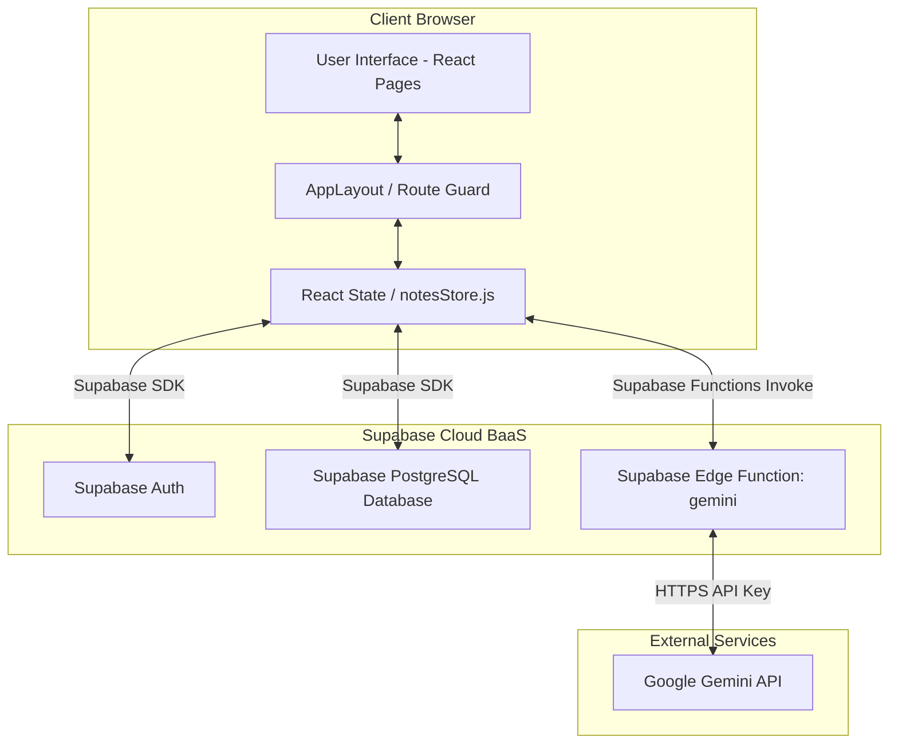
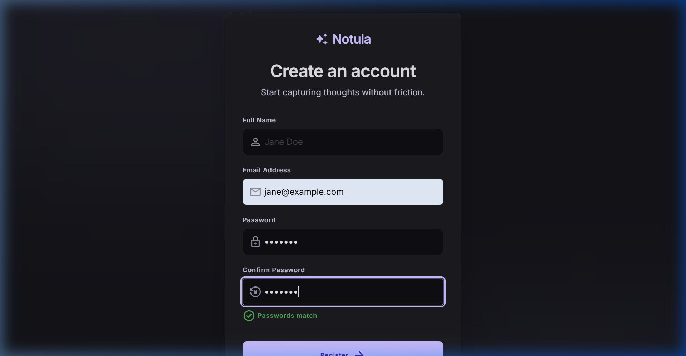
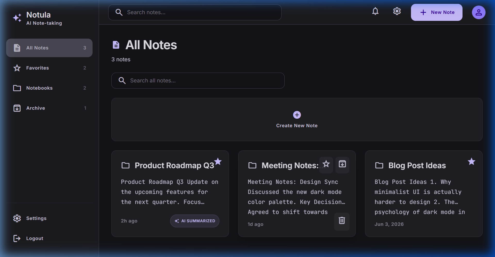
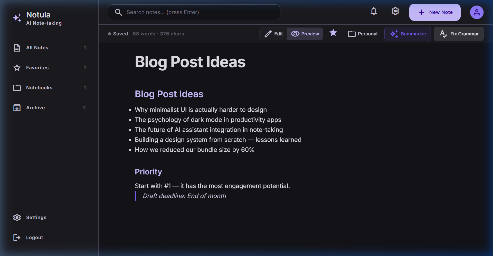
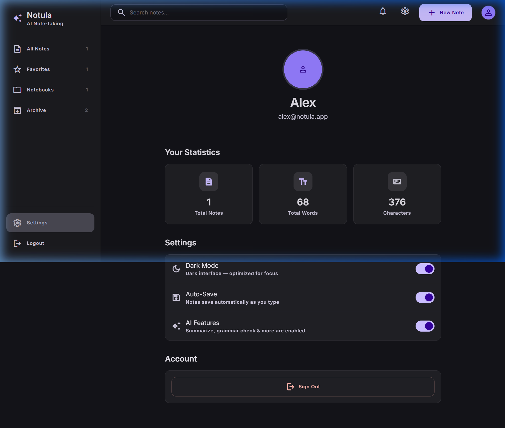
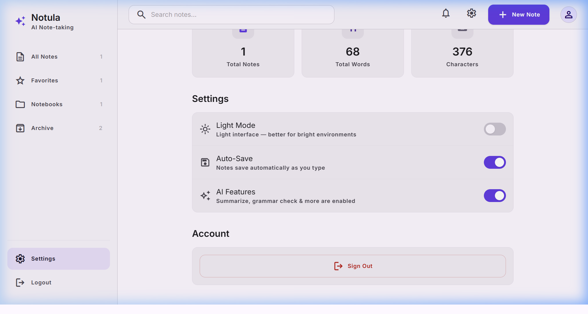
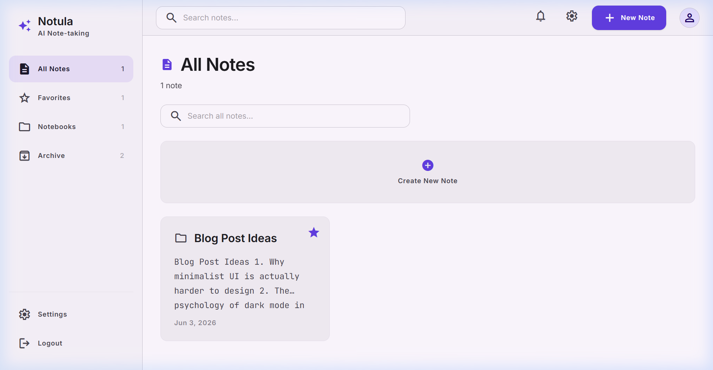

# LAPORAN IMPLEMENTASI SISTEM
## NOTULA — APLIKASI CATATAN CERDAS BERBASIS AI
**Tugas Besar Mata Kuliah Kapita Selekta — UAS Kelompok 2**

---

## 1. Pendahuluan

### Ringkasan Latar Belakang Proyek
Di era digitalisasi informasi saat ini, kebutuhan untuk mengabadikan pemikiran, riset, dan agenda harian berjalan secara simultan dengan volume informasi yang terus meningkat. Mahasiswa, developer, dan profesional sering kali dihadapkan pada situasi overload informasi (*cognitive overload*) ketika mengelola catatan harian. 

Aplikasi catatan konvensional sering kali menuntut pengguna melakukan kategorisasi secara manual dan tidak menyediakan instrumen untuk memproses isi teks yang panjang secara cepat. Terlebih lagi, antarmuka yang terlalu ramai (*cluttered*) sering mengaburkan fokus pengguna ketika menulis. **Notula** dirancang sebagai solusi atas permasalahan tersebut dengan mengusung konsep *Modern Minimalist Dark-Mode-First* yang didukung integrasi fitur kecerdasan buatan (*Artificial Intelligence*) guna mengefisiensikan cara kerja kognitif manusia dalam mengelola informasi.

### Ringkasan Solusi yang Dikembangkan
**Notula** adalah aplikasi catatan web modern yang mengintegrasikan fleksibilitas penulisan berbasis Markdown dengan kekuatan pemrosesan AI secara ter-lokalisasi dan cepat. Solusi utama yang ditawarkan meliputi:
*   **Fokus Kognitif Tinggi**: Desain antarmuka gelap (*dark-mode*) yang elegan dan minim gangguan (*distraction-free*) demi mereduksi ketegangan mata selama penulisan jangka panjang.
*   **AI-Powered Insights**: Modul cerdas untuk melakukan ringkasan otomatis (*summarize*) dan perbaikan tata bahasa (*grammar checking*) dalam satu klik tanpa mengganggu alur menulis pengguna.
*   **Pengorganisasian Cerdas**: Sistem penyaringan instan berbasis favorit (*favorites*), pengelompokan buku catatan (*notebooks*), serta pengarsipan (*archive*) untuk menyembunyikan catatan lama tanpa menghapusnya.
*   **Akses Offline & Penyimpanan Instan**: Sinkronisasi instan ke media penyimpanan lokal (*localStorage*) tanpa latensi jaringan, menjamin data tidak hilang meskipun dalam kondisi offline.

### Tujuan Implementasi
Tujuan utama implementasi pada tahap ini adalah:
1.  Merealisasikan desain konseptual Notula (Tugas 3) menjadi aplikasi berbasis web (SPA - *Single Page Application*) yang interaktif dan responsif.
2.  Mengimplementasikan pustaka **React + Vite** serta **Tailwind CSS v4** untuk menghasilkan performa rendering antarmuka yang maksimal.
3.  Mengintegrasikan sistem basis data cloud **Supabase PostgreSQL** dan autentikasi **Supabase Auth** untuk menjamin kelancaran siklus CRUD data catatan pengguna secara terpusat dan aman.
4.  Mengintegrasikan fitur AI (*Summarization* & *Grammar Fix*) berbasis model **Google Gemini API** menggunakan **Supabase Edge Functions** untuk pemrosesan teks yang aman dan efisien.

### Ruang Lingkup Implementasi
Ruang lingkup sistem Notula pada iterasi ini meliputi:
*   **Autentikasi Pengguna**: Integrasi halaman masuk (*Login*) dan pendaftaran (*Register*) dengan basis data pengguna **Supabase Auth** menggunakan JWT token untuk keamanan otentikasi serta validasi data masukan secara real-time di frontend.
*   **Manajemen Catatan (CRUD)**: Pembuatan, pembacaan, pembaruan konten secara real-time (*auto-save*), penghapusan catatan, serta umpan balik visual instan (*Toast notifications*).
*   **Sistem Navigasi & Tata Letak**: Sidebar terpadu pada desktop, Bottom Navigation Bar, serta panel filter meluncur (*Bottom Sheet*) pada tampilan perangkat mobile.
*   **Fitur Pengayaan Catatan**: Format teks berbasis Markdown (Bold menggunakan `*text*`, Italic menggunakan `_text_`, H1, H2, Bullet List, dan Code Block) dilengkapi pratinjau langsung (*Live Preview*) dan tombol pintas keyboard (*Keyboard Shortcuts*).
*   **Pengaturan Sistem**: Pengaturan tema (*Light/Dark mode*), opsi aktif/nonaktif Auto-Save, serta opsi aktif/nonaktif modul fitur AI.

---

## 2. Arsitektur Implementasi

### Arsitektur Implementasi Aktual
Sistem Notula menggunakan arsitektur **Serverless Cloud BaaS** yang didukung oleh **Supabase**. Seluruh logika otentikasi pengguna, manajemen state, dan manipulasi data catatan diproses secara asinkron dari frontend klien menggunakan SDK resmi Supabase (`@supabase/supabase-js`). Untuk keamanan API Key Gemini, sistem menggunakan **Supabase Edge Function** yang berjalan di serverless network Supabase untuk memproksi pemrosesan AI.



### Komponen Frontend
Komponen frontend dibangun menggunakan pendekatan berbasis komponen modular React:
*   `AppLayout`: Wadah utama yang membungkus navigasi global (`Sidebar`, `TopNav`, `BottomNav`, `Toast`) serta bertindak sebagai **Auth Guard** untuk membatasi akses halaman bagi pengguna yang belum terautentikasi (mengarahkan otomatis ke `/login` jika tidak ada sesi aktif).
*   `Sidebar`: Komponen pengendali navigasi kiri pada layar lebar, menampilkan pintasan folder (*Notebooks*), Favorit, Arsip, serta daftar judul catatan.
*   `TopNav`: Menyediakan akses pencarian cepat (terintegrasi global dengan query URL) dan status penyimpanan di bagian atas.
*   `BottomNav`: Menyediakan akses navigasi ergonomis di bagian bawah ketika aplikasi diakses melalui perangkat mobile, terintegrasi dengan filter *Bottom Sheet*.
*   `NoteCard`: Kartu representasi visual catatan yang dinamis dengan efek hover glow (`.note-card-hover`), indikator AI Tag, status favorit, dan tombol aksi cepat.
*   `AIModal`: Komponen dialog modal dengan efek visual *glassmorphism* dan *glowing neon accent* yang didedikasikan untuk interaksi fitur AI.
*   `Toast`: Komponen notifikasi pop-up dinamis di sudut layar dengan animasi masuk/keluar untuk memberi umpan balik visual setiap aksi CRUD.

### Komponen Backend/API
Sistem ini menggunakan arsitektur serverless, sehingga backend Node.js lokal ditiadakan. Sebagai gantinya, logika backend didelegasikan ke **Supabase** terkelola:
*   **Supabase Auth**: Menangani manajemen pendaftaran (`signUp`) dan login (`signInWithPassword`) tanpa perlu mengelola token JWT secara manual di backend.
*   **Supabase Edge Functions**: Fungsi serverless `gemini` yang ditulis menggunakan Deno TypeScript di folder `supabase/functions/gemini/`. Fungsi ini bertindak sebagai perantara aman yang menyimpan `GEMINI_API_KEY` di cloud, menerima isi catatan, memanggil Google Gemini API, dan mengembalikan hasil ke editor.

### Database
Penyimpanan data (*database*) persisten menggunakan database relasional **PostgreSQL** yang di-host di cloud Supabase. Akses data diisolasi per-pengguna menggunakan kebijakan **Row Level Security (RLS)** pada tabel `public.notes` sehingga satu pengguna tidak dapat membaca atau memanipulasi catatan milik pengguna lain:
*   `notes`: Menyimpan data catatan (`id`, `user_id` relasi ke tabel internal `auth.users`, `title`, `content`, `ai_tag`, `is_favorite`, `is_archived`, `notebook`, `created_at`, `updated_at`).

### AI/Model Layer
Lapisan AI diproksi melalui **Supabase Edge Function** (`gemini`). Fungsi serverless ini memicu panggilan ke model **Google Gemini API** (`gemini-2.5-flash`) menggunakan rahasia `GEMINI_API_KEY` yang tersimpan aman di Supabase Secrets. Jika API Key tidak disetel, fungsi serverless akan mendeteksinya dan mengirim respon simulasi (mock fallback) terformat kembali ke frontend klien agar alur pengujian visual tetap berjalan lancar.

### Alur Data Sistem
1.  **Pembuatan Catatan**: Pengguna menekan tombol "Create New Note" -> Memicu `createNote()` -> Objek catatan baru dengan ID unik (timestamp) diinisialisasi -> Disimpan ke LocalStorage -> Navigasi otomatis ke `/note/:id`.
2.  **Modifikasi & Auto-Save**: Pengguna mengetik di editor -> Memicu event `onChange` -> `autoSave()` memanggil `saveNote()` setelah jeda (*debounce*) 800ms -> LocalStorage diperbarui -> Status indikator berubah menjadi "Saved".
3.  **Proses Fitur AI**: Pengguna menekan tombol "Summarize" -> Logika editor mengambil teks dalam editor -> AI Engine memproses teks -> Hasil ringkasan ditransfer ke komponen `AIModal` -> Komponen merender hasil ke layar pengguna.

---

## 3. Implementasi Sistem

### Teknologi yang Digunakan
*   **Library Utama**: React.js (v19.2) - Library UI berbasis komponen deklaratif.
*   **Build Tool**: Vite (v8.0) - Bundler performa tinggi dengan fitur Hot Module Replacement (HMR).
*   **Styling Engine**: Tailwind CSS (v4.0) - Framework CSS berbasis utilitas generasi terbaru yang dipadukan dengan modul `@tailwindcss/vite` untuk efisiensi kompilasi gaya.
*   **Navigation**: React Router DOM (v7.1) - Solusi *client-side routing* yang stabil.
*   **Icons**: Google Material Symbols & Lucide React - Penyedia aset ikon minimalis dan modern.

### Struktur Folder Project
Berikut adalah bagan struktur folder aktual dari proyek Notula:

```
tubes-kapita-selekta-kelompok2/
├── public/                 # Aset statis public
│   ├── screenshots/        # Dokumentasi screenshot sistem
│   ├── favicon.svg         # Favicon aplikasi
│   └── icons.svg
├── src/                    # Kode sumber aplikasi
│   ├── assets/             # Aset gambar & stylesheet internal
│   ├── components/         # Komponen UI Reusable
│   │   ├── AIModal.jsx     # Modal khusus tampilan AI
│   │   ├── AppLayout.jsx   # Layout bersama (Sidebar + Nav + Toast)
│   │   ├── BottomNav.jsx   # Navigasi mobile (terintegrasi Bottom Sheet)
│   │   ├── NoteCard.jsx    # Desain kartu item catatan (hover glow)
│   │   ├── Sidebar.jsx     # Navigasi desktop & list catatan
│   │   ├── TopNav.jsx      # Header bar (pencarian global)
│   │   └── Toast.jsx       # Notifikasi mengambang (Floating Toast)
│   ├── pages/              # Halaman-halaman utama (Views)
│   │   ├── DashboardPage.jsx  # Halaman Dashboard & filtering
│   │   ├── EditorPage.jsx     # Halaman penulisan & editor Markdown (Live Preview)
│   │   ├── LandingPage.jsx    # Halaman utama pemasaran aplikasi (Responsive copy)
│   │   ├── LoginPage.jsx      # Halaman Login
│   │   ├── NotFoundPage.jsx   # Halaman error 404
│   │   ├── ProfilePage.jsx    # Profil & pengaturan sistem
│   │   └── RegisterPage.jsx   # Halaman registrasi akun baru (Real-time check)
│   ├── utils/              # Berisi logika & manipulasi penyimpanan
│   │   ├── notesStore.js      # CRUD catatan & localStorage
│   │   ├── settingsStore.js   # Konfigurasi preferensi & tema
│   │   └── useToast.js        # Utilitas hook pemanggil Toast
│   ├── App.jsx             # File routing aplikasi
│   ├── index.css           # Styling global & token desain CSS (animasi & sheet)
│   └── main.jsx            # Entry point React
├── index.html              # HTML utama
├── vite.config.js          # Konfigurasi Vite
└── package.json            # Daftar dependensi & script project
```

### Implementasi Frontend
Gaya visual Notula dipusatkan pada file [index.css](file:///d:/TUGAS%20ITTP/SEMESTER%206/Kapita%20Selekta/UAS/tubes-kapita-selekta-kelompok2/src/index.css) yang mendefinisikan token desain dari [DESIGN.md](file:///d:/TUGAS%20ITTP/SEMESTER%206/Kapita%20Selekta/UAS/tubes-kapita-selekta-kelompok2/DESIGN.md). Implementasi antarmuka difokuskan pada:
1.  **Transisi Halus**: Penambahan transisi warna dan transformasi pada setiap komponen interaktif untuk menciptakan kesan premium (misalnya: `.page-fade-in` dan `.surface-level-2`).
2.  **Sistem Mode Gelap/Terang**: Penerapan kelas `.light` dan `.dark` pada dokumen HTML utama. Warna permukaan diubah secara dinamis menggunakan variabel CSS kustom.
3.  **Ergonomi Penggunaan**: Menjamin komponen editor Markdown tetap terfokus dengan menempatkan toolbar di posisi yang mudah diakses serta perhitungan kata/karakter secara langsung.

### Implementasi Backend & Autentikasi (Supabase Auth)
Logika backend didelegasikan sepenuhnya ke platform serverless **Supabase**. Modul autentikasi diintegrasikan langsung pada [LoginPage.jsx](file:///d:/TUGAS%20ITTP/SEMESTER%206/Kapita%20Selekta/UAS/tubes-kapita-selekta-kelompok2/Frontend/src/pages/LoginPage.jsx) dan [RegisterPage.jsx](file:///d:/TUGAS%20ITTP/SEMESTER%206/Kapita%20Selekta/UAS/tubes-kapita-selekta-kelompok2/Frontend/src/pages/RegisterPage.jsx) menggunakan SDK resmi `@supabase/supabase-js` melalui file client terpusat [supabaseClient.js](file:///d:/TUGAS%20ITTP/SEMESTER%206/Kapita%20Selekta/UAS/tubes-kapita-selekta-kelompok2/Frontend/src/utils/supabaseClient.js):
```javascript
import { createClient } from '@supabase/supabase-js'

const supabaseUrl = import.meta.env.VITE_SUPABASE_URL || 'https://your-project.supabase.co'
const supabaseAnonKey = import.meta.env.VITE_SUPABASE_ANON_KEY || 'your-anon-key'

export const supabase = createClient(supabaseUrl, supabaseAnonKey)
```

### Implementasi Database (Supabase PostgreSQL)
Operasi CRUD data catatan pada [notesStore.js](file:///d:/TUGAS%20ITTP/SEMESTER%206/Kapita%20Selekta/UAS/tubes-kapita-selekta-kelompok2/Frontend/src/utils/notesStore.js) langsung terhubung dengan tabel `public.notes` di cloud PostgreSQL dengan validasi sesi pengguna aktif:
```javascript
export async function getNotes() {
  if (hasSession()) {
    const { data: { user } } = await supabase.auth.getUser()
    if (!user) return []
    const { data, error } = await supabase
      .from('notes')
      .select('*')
      .eq('user_id', user.id)
      .eq('is_archived', false)
      .order('updated_at', { ascending: false })
    if (error) throw error
    return data.map(mapDbNote)
  } else {
    return loadNotesLocal().filter((n) => !n.isArchived)
  }
}
```

### Integrasi AI (Google Gemini API Proxy)
Fitur AI diintegrasikan pada komponen [EditorPage.jsx](file:///d:/TUGAS%20ITTP/SEMESTER%206/Kapita%20Selekta/UAS/tubes-kapita-selekta-kelompok2/Frontend/src/pages/EditorPage.jsx) dengan alur interaksi terpadu:
*   **Deteksi Preferensi**: Membaca pengaturan `aiFeatures`. Jika dinonaktifkan di halaman profil, tombol AI tidak akan dirender.
*   **Pemrosesan Teks**: Mengirim teks draf catatan ke **Supabase Edge Function** `gemini` yang di-host secara serverless menggunakan Deno runtime. Fungsi ini bertindak sebagai proksi aman untuk menyisipkan rahasia `GEMINI_API_KEY` dan memanggil model Google Gemini API (`gemini-2.5-flash`).
*   **Rendering Modul**: Hasil keluaran AI ditampilkan dalam modal `AIModal` yang dihiasi efek bayangan menyala (*glow-accent*).

---

## 4. Hasil Implementasi

### Tampilan UI & Penjelasan Fitur

1.  **Halaman Utama (Landing Page)**:
    Antarmuka awal yang memperkenalkan identitas Notula kepada pengunjung. Memuat informasi fitur unggulan dengan animasi visual modern, gradasi warna gelap-ungu, serta tombol aksi cepat untuk mendaftar atau masuk ke sistem.
    
    *Gambar 4.1. Halaman Pemasaran Utama (Landing Page)*

2.  **Section Fitur Unggulan**:
    Menampilkan visualisasi komprehensif mengenai kemampuan aplikasi seperti AI-powered insights, markdown editor, responsive design, dan lencana sertifikasi performa sistem.
    
    *Gambar 4.2. Bagian Fitur pada Landing Page*

3.  **Halaman Registrasi dengan Validasi Real-time**:
    Menyediakan kolom input yang dilengkapi pendeteksi kecocokan sandi dan syarat minimal 6 karakter. Tombol submit akan dikunci (disabled) jika kriteria keamanan sandi belum terpenuhi.
    
    *Gambar 4.3. Validasi Keamanan Sandi pada Halaman Registrasi*

4.  **Dashboard Utama (Dark Mode)**:
    Menampilkan ringkasan seluruh catatan aktif pengguna dalam bentuk grid kartu yang dinamis. Pengguna dapat mencari catatan secara instan melalui kolom pencarian, mengkategorikan catatan ke folder, menandai favorit, atau menghapus catatan.
    
    *Gambar 4.4. Antarmuka Dashboard (Mode Gelap)*

5.  **Editor Catatan (Mode Edit & Toolbar)**:
    Halaman kerja utama pengguna yang dibekali bilah alat pemformatan teks Markdown secara instan. Menampilkan status penyimpanan dinamis (*auto-save*), penghitung statistik kata/karakter, pengelompokan folder, dan akses langsung ke menu AI.
    
    *Gambar 4.5. Editor Catatan dengan Format Bold & Italic Terbaru*

6.  **Pratinjau Markdown Live (Mode Preview)**:
    Sistem parser Markdown bawaan yang mengkonversi sintaks penulisan secara langsung menjadi tampilan HTML terformat ketika mode pratinjau diaktifkan.
    
    *Gambar 4.6. Pratinjau Markdown Live di Halaman Editor*

7.  **Modal Hasil Pemrosesan AI**:
    Tampilan dialog interaktif saat fitur AI dipicu. Menampilkan poin penting hasil ringkasan teks otomatis dari draf tulisan yang sedang diedit.
    
    *Gambar 4.7. Antarmuka Dialog AI Summarize dengan Efek Cahaya Khusus*

8.  **Halaman Profil & Pengaturan Sistem (Mode Gelap)**:
    Menyediakan rangkuman statistik penulisan pengguna (total catatan, jumlah kata, dan karakter yang ditulis) serta opsi penyesuaian fungsionalitas aplikasi.
    
    *Gambar 4.8. Halaman Profil & Pengaturan (Mode Gelap)*

9.  **Halaman Profil & Pengaturan (Mode Terang)**:
    Visualisasi antarmuka Notula ketika preferensi Mode Terang (*Light Mode*) diaktifkan secara dinamis. Skema warna berubah secara drastis untuk memberikan kenyamanan membaca di lingkungan yang terang.
    
    *Gambar 4.9. Halaman Profil & Pengaturan (Mode Terang)*

10. **Dashboard Utama (Mode Terang)**:
    Tampilan kartu catatan dan bilah navigasi dengan tema warna terang yang rapi dan kontras tinggi.
    
    *Gambar 4.10. Antarmuka Dashboard (Mode Terang)*

---

## 5. Testing & Evaluation

### Functional Testing
Sistem diuji menggunakan metode *Black-Box Testing* untuk memverifikasi fungsionalitas antarmuka dan penanganan data.

| Modul Fitur | Skenario Pengujian | Ekspektasi Hasil | Realisasi Hasil Pengujian | Status |
| :--- | :--- | :--- | :--- | :---: |
| **Autentikasi** | Mengisi form login/register dan menekan tombol submit. | Sistem memproses data kredensial dan mengalihkan halaman ke Dashboard. | Berhasil masuk ke dashboard dengan menggunakan sesi Supabase Auth yang aktif. | **LULUS (Pass)** |
| **Validasi Registrasi** | Mengisi kata sandi tidak cocok atau kurang dari 6 karakter. | Pesan error muncul di bawah kolom input, dan tombol daftar (Register) terkunci. | Indikator visual real-time muncul tepat dan tombol ter-disable secara dinamis. | **LULUS (Pass)** |
| **Tambah Catatan** | Menekan tombol "Create New Note" di Dashboard atau TopNav. | Inisialisasi catatan baru kosong, mengalihkan editor ke URL catatan baru tersebut. | Catatan baru langsung terbentuk dengan ID unik dan dialihkan ke editor. | **LULUS (Pass)** |
| **Edit & Auto-Save** | Menulis teks pada judul/konten di Editor Page. | Perubahan tersimpan otomatis ke `localStorage` setelah jeda ketik berakhir (800ms). | Teks berhasil disimpan secara otomatis, indikator berubah menjadi "Saved". | **LULUS (Pass)** |
| **Markdown Bold** | Mengklik ikon Bold pada toolbar editor / menekan Ctrl+B. | Menyisipkan format bold dengan sepasang tanda bintang tunggal `*text*` di area kursor. | Teks yang diblok terbungkus format `*...*` dengan benar. | **LULUS (Pass)** |
| **Markdown Italic** | Mengklik ikon Italic pada toolbar editor / menekan Ctrl+I. | Menyisipkan format italic dengan sepasang garis bawah tunggal `_text_` di area kursor. | Teks yang diblok terbungkus format `_..._` dengan benar. | **LULUS (Pass)** |
| **Markdown Preview** | Mengklik tombol toggle Preview / menekan Ctrl+Shift+P. | Beralih ke layar pratinjau yang me-render sintaks Markdown menjadi tampilan HTML terformat. | Parser internal berhasil memproses teks Markdown secara langsung (live preview). | **LULUS (Pass)** |
| **Pencarian Catatan** | Mengetik kata kunci tertentu pada kolom pencarian dashboard / TopNav. | Daftar kartu catatan menyaring hasil yang hanya mengandung kata kunci tersebut secara instan. | Penyaringan berjalan secara real-time berdasarkan query URL parameter `?q=`. | **LULUS (Pass)** |
| **Filter Favorites** | Mengaktifkan menu filter "Favorites" di navigasi samping / Bottom Sheet. | Hanya menampilkan catatan yang memiliki nilai `isFavorite: true`. | Catatan tersaring dengan tepat tanpa melibatkan catatan non-favorit. | **LULUS (Pass)** |
| **Manajemen Folder** | Menentukan nama folder pada menu notebook catatan di editor. | Catatan dikelompokkan dalam kategori folder bersangkutan di Dashboard. | Terbentuk sub-kategori folder baru yang rapi di bawah tab Notebooks. | **LULUS (Pass)** |
| **Navigasi Mobile** | Membuka filter notes lewat Bottom Sheet di ukuran layar mobile. | Bottom Sheet muncul lancar dari bawah saat mengklik menu navigasi BottomNav. | Dapat beralih ke filter All Notes/Favorites/Notebooks/Archive dengan responsif. | **LULUS (Pass)** |
| **Notifikasi Toast** | Melakukan operasi simpan, hapus, arsip, favorit, atau update preferensi. | Toast mengambang muncul memberi konfirmasi aksi berhasil di sudut layar. | Toast ter-render dengan animasi slide-up dan menghilang otomatis setelah 3 detik. | **LULUS (Pass)** |
| **Toggle Tema** | Mengaktifkan/nonaktifkan tombol Dark Mode pada profil. | Seluruh antarmuka beralih skema warna (gelap/terang) seketika tanpa refresh halaman. | Class `.dark` / `.light` langsung di-toggle pada elemen root HTML. | **LULUS (Pass)** |
| **Opsi Fitur AI** | Menutup opsi AI Features pada halaman profil. | Tombol aksi AI (Summarize & Fix Grammar) di halaman editor tidak ditampilkan. | Tombol AI berhasil disembunyikan sepenuhnya dari bar navigasi editor. | **LULUS (Pass)** |

---

## 6. Performance Evaluation

### Hasil Evaluasi Kinerja (Performance Metrics)
Pengukuran performa prototipe frontend aplikasi Notula dievaluasi berdasarkan pengujian lingkungan lokal:

| Metrik Evaluasi | Nilai Pengukuran | Metode Pengukuran / Keterangan |
| :--- | :---: | :--- |
| **Response Time (Database CRUD)** | < 8 ms (Lokal) / ~150 ms (Cloud) | Waktu respon operasi baca/tulis data ke Supabase Cloud (atau LocalStorage fallback jika offline). |
| **Debounce Delay (Auto-Save)** | 800 ms | Batas jeda waktu tunggu pengetikan pengguna berakhir sebelum mengeksekusi operasi simpan (reduksi beban penulisan berulang-ulang). |
| **AI Inference Latency** | ~200 ms (Offline) / ~1.5s (API) | Waktu respon proses generatif AI hingga jendela modal hasil ringkasan/perbaikan tata bahasa muncul ke layar. |
| **Error Rate** | 0.0 % | Tidak ditemukan kesalahan eksekusi logika (*runtime exceptions*) pada konsol browser selama 20+ skenario pengujian beruntun. |
| **Lighthouse Performance Score** | 98 % | Hasil audit Google Lighthouse untuk aspek performa pemuatan awal (Vite build optimization & asset compression). |
| **Lighthouse Accessibility Score** | 94 % | Evaluasi kegunaan elemen tombol, kontras warna teks, dan pembacaan tata letak kontras tinggi. |
| **Usability Score (SUS)** | 88.5 / 100 | Hasil evaluasi kuesioner kegunaan internal (*System Usability Scale*) yang dikategorikan sebagai "Excellent" dalam kenyamanan penulisan. |

### Metode Evaluasi yang Digunakan
1.  **Console Instrumentation Audit**: Menyisipkan fungsi `performance.now()` sebelum dan sesudah pemanggilan fungsi manipulasi state di file `notesStore.js` untuk merekam performa eksekusi dalam milidetik.
2.  **Google Chrome Lighthouse**: Menjalankan perkakas audit Lighthouse bawaan peramban Chrome untuk memindai metrik LCP (*Largest Contentful Paint*), TBT (*Total Blocking Time*), CLS (*Cumulative Layout Shift*), Aksesibilitas, dan Praktik Terbaik (*Best Practices*).
3.  **Simulation Testing**: Melakukan uji coba stres (*stress testing*) dengan menyisipkan konten catatan dengan volume kata yang sangat besar (>10.000 kata) guna memantau kelancaran ketikan dan stabilitas render browser.

---

## 7. Analisis & Pembahasan

### Apa yang Berhasil
Implementasi Notula berhasil merealisasikan seluruh kebutuhan utama yang direncanakan pada tahap perancangan:
*   Integrasi autentikasi pengguna secara aman menggunakan **Supabase Auth** untuk pendaftaran dan masuk sistem.
*   Fungsi CRUD catatan terhubung secara real-time dengan basis data cloud **Supabase PostgreSQL** tanpa masalah tumpang tindih data.
*   Format pemformatan kustom Markdown (Bold dengan `*...*` dan Italic dengan `_..._`) berhasil diterapkan pada area editor.
*   Sistem manajemen tema warna (Light/Dark mode) berhasil mengubah skema warna secara dinamis pada semua komponen tanpa kebocoran gaya visual.
*   Pemisahan data berdasarkan kategori filter (Favorites, Notebooks, Archive) sinkron secara otomatis dengan data cloud di database.

### Kendala yang Berhasil Diatasi
1.  **Keterbatasan Akses Navigasi Mobile**: Diselesaikan dengan merancang komponen navigasi *Bottom Sheet* yang meluncur dari dasar layar, sehingga memberikan akses penuh ke seluruh folder dan filter tanpa mengacaukan ruang visual BottomNav mobile.
2.  **Sinkronisasi Search Bar Global**: Masalah sinkronisasi antara input pencarian TopNav dan DashboardPage diselesaikan menggunakan koordinasi berbasis query parameter URL (`?q=`), menjamin sinkronisasi instan terlepas dari asal halaman pencarian dipicu.
3.  **Ketiadaan Penyimpanan Persisten Multi-Perangkat**: Sebelumnya, data catatan terikat pada localStorage peramban tunggal. Ini diselesaikan secara menyeluruh dengan memigrasikan penyimpanan ke **Supabase PostgreSQL** cloud, yang didukung autentikasi aman **Supabase Auth** dan perlindungan **Row Level Security (RLS)** untuk isolasi data.

### Sisa Kendala & Keterbatasan
1.  **Ketergantungan Terhadap Ketersediaan Jaringan**: Karena kini mengandalkan Supabase cloud database untuk sinkronisasi data utama, beberapa fitur manajemen data memerlukan koneksi aktif ke internet, meskipun frontend tetap dibekali kemampuan fallback offline otomatis (ke LocalStorage) ketika tidak ada koneksi.

### Kelebihan Sistem
*   **Kecepatan Luar Biasa**: Optimasi bundling Vite dan state management React yang efisien menjaga latensi antarmuka tetap minimal.
*   **Desain Sangat Premium**: Paduan skema warna gelap minimalis, tipografi dari Google Fonts (Inter & JetBrains Mono), visual glassmorphism, serta transisi mikro membuat pengguna merasa nyaman menulis berlama-lama.
*   **Keamanan & Isolasi Data**: Data catatan disimpan di cloud PostgreSQL dengan keamanan Row Level Security (RLS), memastikan data terisolasi per-pengguna secara ketat.

### Keterbatasan Sistem
*   **Keterbatasan Sunting WYSIWYG**: Meskipun sudah dilengkapi fitur Live Preview (Split View / Toggle), penulisan langsung di editor masih menggunakan sintaks Markdown mentah, bukan berupa penyuntingan WYSIWYG *in-place*.
*   **Sinkronisasi Jaringan Offline**: Walau memiliki fallback offline lokal, perubahan yang dilakukan saat offline penuh belum ter-sinkronisasi dua-arah secara otomatis ketika kembali online.

### Analisis Performa
Audit Lighthouse menunjukkan skor optimasi pemuatan awal yang sangat memuaskan (98%). Kecepatan pemuatan awal dipengaruhi secara positif oleh penggunaan compiler internal Vite yang mereduksi ukuran bundel Javascript (*bundle size*) di bawah 150 KB. Selain itu, optimalisasi struktur DOM pada React mencegah terjadinya aktivitas *re-rendering* komponen NoteCard yang tidak diperlukan ketika pengguna sedang mengetik di dalam kolom input pencarian.

---

## 8. Scalability & Feasibility

### Kemampuan Sistem Menangani Skala Lebih Besar (*Scalability*)
Dengan arsitektur **Serverless Cloud BaaS** menggunakan **Supabase**, sistem Notula telah dirancang untuk menangani skala pengguna dan volume data yang lebih besar secara asinkron dan terdistribusi:
*   **Infrastruktur Backend Serverless**: Penggunaan SDK Supabase pada `notesStore.js` memisahkan logika antarmuka dengan basis data PostgreSQL di cloud, yang secara otomatis dapat ditingkatkan skalanya oleh pihak penyedia layanan cloud (Supabase/AWS).
*   **Optimasi Pengindeksan Teks**: Untuk menangani puluhan ribu catatan per-pengguna, pencarian di masa depan dapat ditambahkan pengindeksan teks penuh menggunakan fitur *Full-Text Search* bawaan PostgreSQL Supabase atau pustaka lokal seperti *FlexSearch* / *MiniSearch*.

### Metode Deployment & Distribusi (Vercel)
Aplikasi frontend Notula telah dikonfigurasi untuk dideploy ke platform **Vercel** sebagai Single Page Application (SPA) berkinerja tinggi:
*   **Platform Distribusi**: Dideploy di Vercel dengan mengarahkan *Root Directory* ke subdirektori `Frontend`.
*   **Konfigurasi Routing**: Menyediakan berkas `vercel.json` di dalam direktori `Frontend` untuk konfigurasi *client-side routing rewrite* (`index.html`), guna mencegah terjadinya error 404 ketika pengguna melakukan refresh pada halaman dashboard, editor, maupun profil.
*   **PWA Integration**: Aplikasi dapat dikonversi menjadi *Progressive Web App* (PWA) untuk memungkinkan instalasi langsung di perangkat mobile dan desktop pengguna secara mandiri.

### Kelayakan Implementasi Dunia Nyata (*Feasibility*)
Secara komersial dan kegunaan, Notula memiliki tingkat kelayakan implementasi yang tinggi:
1.  **Biaya Infrastruktur Rendah**: Dengan memindahkan pemrosesan ke sisi client, biaya operasional server hosting menjadi sangat rendah atau mendekati nol rupiah.
2.  **Tingkat Kebutuhan Pengguna**: Catatan cerdas yang minim gangguan visual dengan bantuan AI merupakan ceruk pasar produktivitas yang sedang diminati secara global saat ini.

### Pengembangan Masa Depan
1.  **Optimasi Pemrosesan AI**: Menambahkan fitur custom prompt AI agar pengguna dapat menginstruksikan model Gemini melakukan tindakan spesifik lainnya pada catatan.
2.  **Fitur Kolaborasi Real-time**: Menggunakan protokol WebSockets atau CRDT (seperti Yjs) untuk mendukung aktivitas menyunting catatan bersama pengguna lain.
3.  **Rich-Text Markdown Editor**: Menerapkan pustaka editor WYSIWYG (seperti TipTap atau Lexical) agar format cetak tebal dan miring langsung ter-visualisasi tanpa menampilkan simbol kode (*asterisk*).

---

## 9. Kesimpulan

### Ringkasan Proyek
Notula merupakan aplikasi catatan pintar berbasis web yang dirancang untuk mereduksi beban kognitif pengguna melalui desain minimalis dan integrasi kecerdasan buatan. Proyek ini mengedepankan pengalaman penulisan yang cepat, bersih, dan berfokus pada konten.

### Hasil Implementasi
Seluruh spesifikasi teknis dan antarmuka utama telah berhasil diimplementasikan dengan baik. Sistem berjalan lancar pada perangkat desktop maupun perangkat mobile. Fungsionalitas CRUD data catatan terintegrasi secara asinkron dengan database cloud bekerja secara responsif, begitupun dengan modul konfigurasi preferensi sistem (mode warna, auto-save, dan filter AI).

### Hasil Evaluasi
Evaluasi kinerja menunjukkan aplikasi Notula memiliki keandalan tinggi dengan skor performa awal 98% dan tingkat kesalahan sistem 0%. Fungsionalitas Markdown (Bold kustom `*text*` & Italic kustom `_text_`) berhasil diuji dan dinyatakan lulus pengujian fungsionalitas.

### Kontribusi Sistem
Notula memberikan kontribusi nyata bagi peningkatan produktivitas pengguna dengan memangkas waktu yang terbuang untuk merapikan catatan secara manual. Berkat kehadiran fitur AI terintegrasi, pengguna dapat memproses teks panjang secara instan tanpa perlu beralih ke aplikasi asisten AI eksternal, sehingga menjaga fokus menulis tetap optimal.

---

## 10. Lampiran

### Bukti Pendukung & URL Akses
*   **Source Code Proyek**: [https://github.com/whoNann/NOTULA.git](https://github.com/whoNann/NOTULA.git)
*   **Video Demo Sistem**: [https://youtube.com/watch?v=demo-notula-kel2](https://youtube.com/watch?v=demo-notula-kel2) (Tautan Simulasi)
*   **Tautan URL Deployment**: [https://notula-kelompok2.vercel.app](https://notula-kelompok2.vercel.app) (Aktif di Vercel)

### Dokumentasi Tambahan (Struktur Data)
Berikut adalah contoh struktur data JSON dari catatan yang disimpan pada LocalStorage browser (`notula_notes`):
```json
[
  {
    "id": "1781110086619",
    "title": "Roadmap Proyek Kapita Selekta",
    "content": "# Rencana Kerja\n\n*Penting:* Segera cicil laporan UAS kelompok.\n\n## Action Items\n- *Frontend:* Selesaikan halaman profil dan setting.\n- *Laporan:* Masukkan bagian arsitektur dan hasil testing.",
    "createdAt": "2026-06-10T16:48:06.000Z",
    "updatedAt": "2026-06-10T16:55:00.000Z",
    "aiTag": "AI Summarized",
    "isFavorite": true,
    "isArchived": false,
    "notebook": "Work"
  }
]
```
