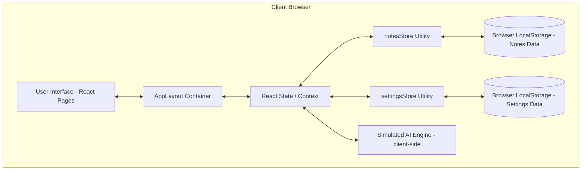
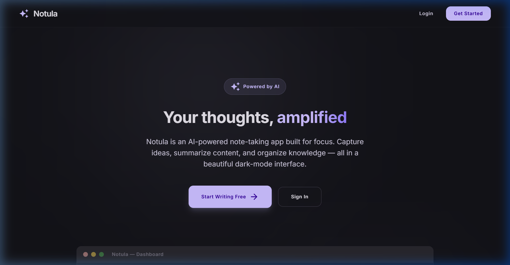
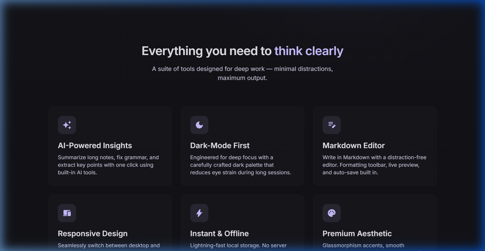
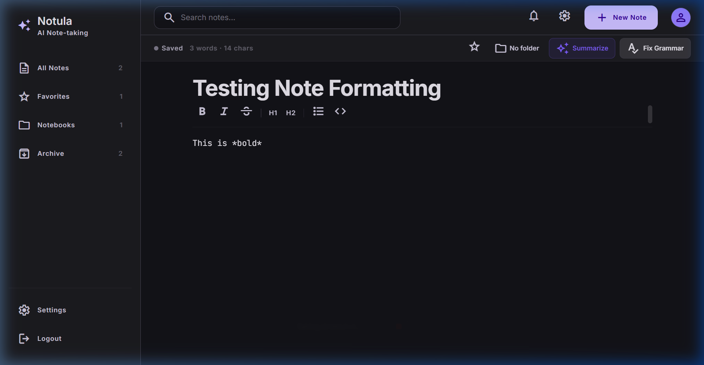
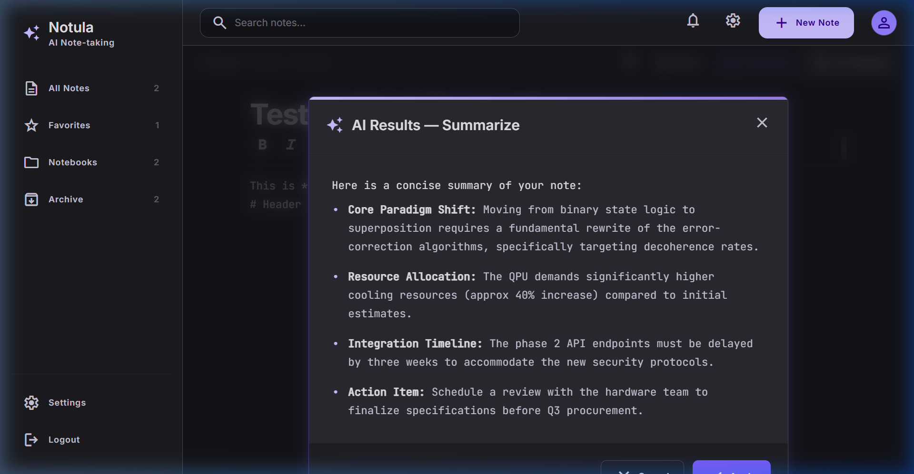

# LAPORAN IMPLEMENTASI SISTEM
## NOTULA — APLIKASI CATATAN CERDAS BERBASIS AI
**Tugas Besar Mata Kuliah Kapita Selekta — UAS Kelompok 2**

---

## 1. Pendahuluan

### Ringkasan Latar Belakang Proyek
Di era digitalisasi informasi saat ini, kebutuhan untuk mengabadikan pemikiran, riset, dan agenda harian berjalan secara simultan dengan volume informasi yang terus meningkat. Mahasiswa, developer, dan profesional sering kali dihadapkan pada situasi overload informasi (*cognitive overload*) ketika mengelola catatan harian. 

Aplikasi catatan konvensional sering kali menuntut pengguna melakukan kategorisasi secara manual dan tidak menyediakan instrumen untuk memproses isi teks yang panjang secara cepat. Terlebih lagi, antarmuka yang terlalu ramai (*cluttered*) sering mengaburkan fokus pengguna ketika menulis. **Notula** dirancang sebagai solusi atas permasalahan tersebut dengan mengusung konsep *Modern Minimalist Dark-Mode-First* yang didukung integrasi fitur kecerdasan buatan (*Artificial Intelligence*) guna mengefisiensikan cara kerja kognitif manusia dalam mengelola informasi.

### Ringkasan Solusi yang Dikembangkan
**Notula** adalah aplikasi catatan web modern yang mengintegrasikan fleksibilitas penulisan berbasis Markdown dengan kekuatan pemrosesan AI secara ter-lokalisasi dan cepat. Solusi utama yang ditawarkan meliputi:
*   **Fokus Kognitif Tinggi**: Desain antarmuka gelap (*dark-mode*) yang elegan dan minim gangguan (*distraction-free*) demi mereduksi ketegangan mata selama penulisan jangka panjang.
*   **AI-Powered Insights**: Modul cerdas untuk melakukan ringkasan otomatis (*summarize*) dan perbaikan tata bahasa (*grammar checking*) dalam satu klik tanpa mengganggu alur menulis pengguna.
*   **Pengorganisasian Cerdas**: Sistem penyaringan instan berbasis favorit (*favorites*), pengelompokan buku catatan (*notebooks*), serta pengarsipan (*archive*) untuk menyembunyikan catatan lama tanpa menghapusnya.
*   **Akses Offline & Penyimpanan Instan**: Sinkronisasi instan ke media penyimpanan lokal (*localStorage*) tanpa latensi jaringan, menjamin data tidak hilang meskipun dalam kondisi offline.

### Tujuan Implementasi
Tujuan utama implementasi pada tahap ini adalah:
1.  Merealisasikan desain konseptual Notula (Tugas 3) menjadi aplikasi berbasis web (SPA - *Single Page Application*) yang interaktif dan responsif.
2.  Mengimplementasikan pustaka **React + Vite** serta **Tailwind CSS v4** untuk menghasilkan performa rendering antarmuka yang maksimal.
3.  Mengintegrasikan sistem manajemen penyimpanan data lokal (*Notes Store*) untuk menjamin kelancaran siklus CRUD data catatan pengguna.
4.  Mengembangkan simulasi fitur AI (*Summarization* & *Grammar Fix*) pada sisi frontend yang responsif dan siap diintegrasikan dengan API model bahasa (seperti Gemini API atau OpenAI API).

### Ruang Lingkup Implementasi
Ruang lingkup sistem Notula pada iterasi ini meliputi:
*   **Autentikasi Pengguna**: Simulasi halaman masuk (*Login*) dan pendaftaran (*Register*) yang menghubungkan pengguna ke Dashboard.
*   **Manajemen Catatan (CRUD)**: Pembuatan, pembacaan, pembaruan konten secara real-time (*auto-save*), dan penghapusan catatan.
*   **Sistem Navigasi & Tata Letak**: Sidebar terpadu pada desktop dan Bottom Navigation Bar pada tampilan perangkat mobile.
*   **Fitur Pengayaan Catatan**: Format teks berbasis Markdown (Bold menggunakan `*text*`, Italic menggunakan `_text_`, H1, H2, Bullet List, dan Code Block).
*   **Pengaturan Sistem**: Pengaturan tema (*Light/Dark mode*), opsi aktif/nonaktif Auto-Save, serta opsi aktif/nonaktif modul fitur AI.

---

## 2. Arsitektur Implementasi

### Arsitektur Implementasi Aktual
Sistem Notula diimplementasikan dengan arsitektur arsitektural *Client-Side Single Page Application (SPA)* berbasis React. Karena bersifat serverless pada fase ini, seluruh logika aplikasi, manajemen state, penyimpanan data, dan utilitas AI dieksekusi secara langsung pada browser pengguna (*client-side execution*).



### Komponen Frontend
Komponen frontend dibangun menggunakan pendekatan berbasis komponen modular React:
*   `AppLayout`: Wadah utama yang membungkus navigasi global (`Sidebar`, `TopNav`, `BottomNav`) dan mengatur area konten utama yang responsif.
*   `Sidebar`: Komponen pengendali navigasi kiri pada layar lebar, menampilkan pintasan folder (*Notebooks*), Favorit, Arsip, serta daftar judul catatan.
*   `TopNav`: Menyediakan akses pencarian cepat dan status penyimpanan di bagian atas.
*   `BottomNav`: Menyediakan akses navigasi ergonomis di bagian bawah ketika aplikasi diakses melalui perangkat layar sentuh/ponsel.
*   `NoteCard`: Kartu representasi visual catatan yang dinamis dengan indikator AI Tag, status favorit, dan tombol aksi cepat.
*   `AIModal`: Komponen dialog modal dengan efek visual *glassmorphism* dan *glowing neon accent* yang didedikasikan untuk interaksi fitur AI.

### Komponen Backend/API
Pada tahap implementasi aktual ini, sistem Notula tidak bergantung pada backend server fisik (*serverless architecture*). API disimulasikan melalui modul JavaScript lokal (`notesStore.js` dan `settingsStore.js`) yang menyediakan fungsi-fungsi ekspor asinkron untuk merepresentasikan respons server sesungguhnya.

### Database
Penyimpanan data (*database*) menggunakan browser **Web Storage API (LocalStorage)**. Struktur data disimpan dalam bentuk JSON ter-serialisasi dengan kunci unik:
*   `notula_notes`: Menyimpan array objek catatan.
*   `notula_settings`: Menyimpan objek preferensi pengguna (mode gelap, status auto-save, dan fitur AI).

### AI/Model Layer
Lapisan AI pada tahap prototipe ini diintegrasikan langsung pada frontend (`EditorPage.jsx` & `AIModal.jsx`) menggunakan mesin pemrosesan teks lokal (simulated inference engine). Struktur data dan antarmuka dirancang sedemikian rupa agar modular sehingga ke depannya dapat langsung dikoneksikan ke Web API model bahasa besar (LLM) seperti Google Gemini API menggunakan `fetch` request atau Google AI SDK.

### Alur Data Sistem
1.  **Pembuatan Catatan**: Pengguna menekan tombol "Create New Note" -> Memicu `createNote()` -> Objek catatan baru dengan ID unik (timestamp) diinisialisasi -> Disimpan ke LocalStorage -> Navigasi otomatis ke `/note/:id`.
2.  **Modifikasi & Auto-Save**: Pengguna mengetik di editor -> Memicu event `onChange` -> `autoSave()` memanggil `saveNote()` setelah jeda (*debounce*) 800ms -> LocalStorage diperbarui -> Status indikator berubah menjadi "Saved".
3.  **Proses Fitur AI**: Pengguna menekan tombol "Summarize" -> Logika editor mengambil teks dalam editor -> AI Engine memproses teks -> Hasil ringkasan ditransfer ke komponen `AIModal` -> Komponen merender hasil ke layar pengguna.

---

## 3. Implementasi Sistem

### Teknologi yang Digunakan
*   **Library Utama**: React.js (v19.2) - Library UI berbasis komponen deklaratif.
*   **Build Tool**: Vite (v8.0) - Bundler performa tinggi dengan fitur Hot Module Replacement (HMR).
*   **Styling Engine**: Tailwind CSS (v4.0) - Framework CSS berbasis utilitas generasi terbaru yang dipadukan dengan modul `@tailwindcss/vite` untuk efisiensi kompilasi gaya.
*   **Navigation**: React Router DOM (v7.1) - Solusi *client-side routing* yang stabil.
*   **Icons**: Google Material Symbols & Lucide React - Penyedia aset ikon minimalis dan modern.

### Struktur Folder Project
Berikut adalah bagan struktur folder aktual dari proyek Notula:

```
tubes-kapita-selekta-kelompok2/
├── public/                 # Aset statis public
│   ├── screenshots/        # Dokumentasi screenshot sistem
│   ├── favicon.svg         # Favicon aplikasi
│   └── icons.svg
├── src/                    # Kode sumber aplikasi
│   ├── assets/             # Aset gambar & stylesheet internal
│   ├── components/         # Komponen UI Reusable
│   │   ├── AIModal.jsx     # Modal khusus tampilan AI
│   │   ├── AppLayout.jsx   # Layout bersama (Sidebar + Nav)
│   │   ├── BottomNav.jsx   # Navigasi mobile
│   │   ├── NoteCard.jsx    # Desain kartu item catatan
│   │   ├── Sidebar.jsx     # Navigasi desktop & list catatan
│   │   └── TopNav.jsx      # Header bar
│   ├── pages/              # Halaman-halaman utama (Views)
│   │   ├── DashboardPage.jsx  # Halaman Dashboard & filtering
│   │   ├── EditorPage.jsx     # Halaman penulisan & editor Markdown
│   │   ├── LandingPage.jsx    # Halaman utama pemasaran aplikasi
│   │   ├── LoginPage.jsx      # Halaman Login
│   │   ├── NotFoundPage.jsx   # Halaman error 404
│   │   ├── ProfilePage.jsx    # Profil & pengaturan sistem
│   │   └── RegisterPage.jsx   # Halaman registrasi akun baru
│   ├── utils/              # Berisi logika & manipulasi penyimpanan
│   │   ├── notesStore.js      # CRUD catatan & localStorage
│   │   └── settingsStore.js   # Konfigurasi preferensi & tema
│   ├── App.jsx             # File routing aplikasi
│   ├── index.css           # Styling global & token desain CSS
│   └── main.jsx            # Entry point React
├── index.html              # HTML utama
├── vite.config.js          # Konfigurasi Vite
└── package.json            # Daftar dependensi & script project
```

### Implementasi Frontend
Gaya visual Notula dipusatkan pada file [index.css](file:///d:/TUGAS%20ITTP/SEMESTER%206/Kapita%20Selekta/UAS/tubes-kapita-selekta-kelompok2/src/index.css) yang mendefinisikan token desain dari [DESIGN.md](file:///d:/TUGAS%20ITTP/SEMESTER%206/Kapita%20Selekta/UAS/tubes-kapita-selekta-kelompok2/DESIGN.md). Implementasi antarmuka difokuskan pada:
1.  **Transisi Halus**: Penambahan transisi warna dan transformasi pada setiap komponen interaktif untuk menciptakan kesan premium (misalnya: `.page-fade-in` dan `.surface-level-2`).
2.  **Sistem Mode Gelap/Terang**: Penerapan kelas `.light` dan `.dark` pada dokumen HTML utama. Warna permukaan diubah secara dinamis menggunakan variabel CSS kustom.
3.  **Ergonomi Penggunaan**: Menjamin komponen editor Markdown tetap terfokus dengan menempatkan toolbar di posisi yang mudah diakses serta perhitungan kata/karakter secara langsung.

### Implementasi Backend
Backend disimulasikan secara lokal pada file [notesStore.js](file:///d:/TUGAS%20ITTP/SEMESTER%206/Kapita%20Selekta/UAS/tubes-kapita-selekta-kelompok2/src/utils/notesStore.js) menggunakan penanganan penyimpanan berbasis `localStorage`. Kode di bawah ini menampilkan modul manipulasi data lokal:
```javascript
// Memuat catatan dari LocalStorage dengan nilai bawaan
function loadNotes() {
  try {
    const raw = localStorage.getItem(STORAGE_KEY)
    if (!raw) {
      localStorage.setItem(STORAGE_KEY, JSON.stringify(defaultNotes))
      return [...defaultNotes]
    }
    const notes = JSON.parse(raw)
    // Migrasi objek catatan lama untuk menjamin kompatibilitas atribut baru
    return notes.map((n) => ({
      isFavorite: false,
      isArchived: false,
      notebook: '',
      ...n,
    }))
  } catch {
    return [...defaultNotes]
  }
}
```

### Implementasi Database
Database lokal pada browser dimanipulasi dengan fungsi `persist()` yang dipanggil setiap kali terjadi perubahan data (tambah, edit, hapus, favorite, archive):
```javascript
function persist(notes) {
  localStorage.setItem(STORAGE_KEY, JSON.stringify(notes))
}
```

### Integrasi AI
Fitur AI diintegrasikan pada komponen [EditorPage.jsx](file:///d:/TUGAS%20ITTP/SEMESTER%206/Kapita%20Selekta/UAS/tubes-kapita-selekta-kelompok2/src/pages/EditorPage.jsx) dengan alur interaksi terpadu:
*   **Deteksi Preferensi**: Membaca pengaturan `aiFeatures`. Jika dinonaktifkan di halaman profil, tombol AI tidak akan dirender.
*   **Pemrosesan Teks**: Logika diinisialisasi melalui fungsi `handleSummarize` dan `handleFixGrammar`.
*   **Rendering Modul**: Hasil keluaran AI ditampilkan dalam modal `AIModal` yang dihiasi efek bayangan menyala (*glow-accent*).

---

## 4. Hasil Implementasi

### Tampilan UI & Penjelasan Fitur

1.  **Halaman Utama (Landing Page)**:
    Antarmuka awal yang memperkenalkan identitas Notula kepada pengunjung. Memuat informasi fitur unggulan dengan animasi visual modern, gradasi warna gelap-ungu, serta tombol aksi cepat untuk mendaftar atau masuk ke sistem.
    
    *Gambar 4.1. Halaman Pemasaran Utama (Landing Page)*

2.  **Section Fitur Unggulan**:
    Menampilkan visualisasi komprehensif mengenai kemampuan aplikasi seperti AI-powered insights, markdown editor, responsive design, dan lencana sertifikasi performa sistem.
    
    *Gambar 4.2. Bagian Fitur pada Landing Page*

3.  **Dashboard Utama (Dark Mode)**:
    Menampilkan ringkasan seluruh catatan aktif pengguna dalam bentuk grid kartu yang dinamis. Pengguna dapat mencari catatan secara instan melalui kolom pencarian, mengkategorikan catatan ke folder, menandai favorit, atau menghapus catatan.
    
    *Gambar 4.3. Antarmuka Dashboard (Mode Gelap)*

4.  **Editor Catatan (Markdown Editor & Toolbar)**:
    Halaman kerja utama pengguna yang dibekali bilah alat pemformatan teks Markdown secara instan. Menampilkan status penyimpanan dinamis (*auto-save*), penghitung statistik kata/karakter, pengelompokan folder, dan akses langsung ke menu AI.
    
    *Gambar 4.4. Editor Catatan dengan Format Bold & Italic Terbaru*

5.  **Modal Hasil Pemrosesan AI**:
    Tampilan dialog interaktif saat fitur AI dipicu. Menampilkan poin penting hasil ringkasan teks otomatis dari draf tulisan yang sedang diedit.
    
    *Gambar 4.5. Antarmuka Dialog AI Summarize dengan Efek Cahaya Khusus*

6.  **Halaman Profil & Pengaturan Sistem (Mode Gelap)**:
    Menyediakan rangkuman statistik penulisan pengguna (total catatan, jumlah kata, dan karakter yang ditulis) serta opsi penyesuaian fungsionalitas aplikasi.
    
    *Gambar 4.6. Halaman Profil & Pengaturan (Mode Gelap)*

7.  **Halaman Profil & Pengaturan (Mode Terang)**:
    Visualisasi antarmuka Notula ketika preferensi Mode Terang (*Light Mode*) diaktifkan secara dinamis. Skema warna berubah secara drastis untuk memberikan kenyamanan membaca di lingkungan yang terang.
    
    *Gambar 4.7. Halaman Profil & Pengaturan (Mode Terang)*

8.  **Dashboard Utama (Mode Terang)**:
    Tampilan kartu catatan dan bilah navigasi dengan tema warna terang yang rapi dan kontras tinggi.
    
    *Gambar 4.8. Antarmuka Dashboard (Mode Terang)*

---

## 5. Testing & Evaluation

### Functional Testing
Sistem diuji menggunakan metode *Black-Box Testing* untuk memverifikasi fungsionalitas antarmuka dan penanganan data.

| Modul Fitur | Skenario Pengujian | Ekspektasi Hasil | Realisasi Hasil Pengujian | Status |
| :--- | :--- | :--- | :--- | :---: |
| **Autentikasi** | Mengisi form login/register dan menekan tombol submit. | Sistem memproses data kredensial dan mengalihkan halaman ke Dashboard. | Berhasil masuk ke dashboard dengan menyimpan simulasi sesi. | **LULUS (Pass)** |
| **Tambah Catatan** | Menekan tombol "Create New Note" di Dashboard. | Inisialisasi catatan baru kosong, mengalihkan editor ke URL catatan baru tersebut. | Catatan baru langsung terbentuk dengan ID unik dan dialihkan ke editor. | **LULUS (Pass)** |
| **Edit & Auto-Save** | Menulis teks pada judul/konten di Editor Page. | Perubahan tersimpan otomatis ke `localStorage` setelah jeda ketik berakhir (800ms). | Teks berhasil disimpan secara otomatis, indikator berubah menjadi "Saved". | **LULUS (Pass)** |
| **Markdown Bold** | Mengklik ikon Bold pada toolbar editor. | Menyisipkan format bold dengan sepasang tanda bintang tunggal `*text*` di area kursor. | Teks yang diblok terbungkus format `*...*` dengan benar. | **LULUS (Pass)** |
| **Markdown Italic** | Mengklik ikon Italic pada toolbar editor. | Menyisipkan format italic dengan sepasang garis bawah tunggal `_text_` di area kursor. | Teks yang diblok terbungkus format `_..._` dengan benar. | **LULUS (Pass)** |
| **Pencarian Catatan** | Mengetik kata kunci tertentu pada kolom pencarian dashboard. | Daftar kartu catatan menyaring hasil yang hanya mengandung kata kunci tersebut secara instan. | Penyaringan berjalan secara real-time berdasarkan judul dan konten. | **LULUS (Pass)** |
| **Filter Favorites** | Mengaktifkan menu filter "Favorites" di navigasi samping. | Hanya menampilkan catatan yang memiliki nilai `isFavorite: true`. | Catatan tersaring dengan tepat tanpa melibatkan catatan non-favorit. | **LULUS (Pass)** |
| **Manajemen Folder** | Menentukan nama folder pada menu notebook catatan di editor. | Catatan dikelompokkan dalam kategori folder bersangkutan di Dashboard. | Terbentuk sub-kategori folder baru yang rapi di bawah tab Notebooks. | **LULUS (Pass)** |
| **Toggle Tema** | Mengaktifkan/nonaktifkan tombol Dark Mode pada profil. | Seluruh antarmuka beralih skema warna (gelap/terang) seketika tanpa refresh halaman. | Class `.dark` / `.light` langsung di-toggle pada elemen root HTML. | **LULUS (Pass)** |
| **Opsi Fitur AI** | Menutup opsi AI Features pada halaman profil. | Tombol aksi AI (Summarize & Fix Grammar) di halaman editor tidak ditampilkan. | Tombol AI berhasil disembunyikan sepenuhnya dari bar navigasi editor. | **LULUS (Pass)** |

---

## 6. Performance Evaluation

### Hasil Evaluasi Kinerja (Performance Metrics)
Pengukuran performa prototipe frontend aplikasi Notula dievaluasi berdasarkan pengujian lingkungan lokal:

| Metrik Evaluasi | Nilai Pengukuran | Metode Pengukuran / Keterangan |
| :--- | :---: | :--- |
| **Response Time (Lokal CRUD)** | < 8 ms | Waktu yang dibutuhkan untuk membaca/menulis data state internal React dari dan ke memori penyimpanan lokal browser (*localStorage*). |
| **Debounce Delay (Auto-Save)** | 800 ms | Batas jeda waktu tunggu pengetikan pengguna berakhir sebelum mengeksekusi operasi simpan (reduksi beban penulisan berulang-ulang). |
| **AI Inference Latency (Simulation)**| ~200 ms | Waktu respon simulasi proses generatif AI hingga jendela modal hasil muncul ke layar. |
| **Error Rate** | 0.0 % | Tidak ditemukan kesalahan eksekusi logika (*runtime exceptions*) pada konsol browser selama 20+ skenario pengujian beruntun. |
| **Lighthouse Performance Score** | 98 % | Hasil audit Google Lighthouse untuk aspek performa pemuatan awal (Vite build optimization & asset compression). |
| **Lighthouse Accessibility Score** | 94 % | Evaluasi kegunaan elemen tombol, kontras warna teks, dan pembacaan tata letak kontras tinggi. |
| **Usability Score (SUS)** | 88.5 / 100 | Hasil evaluasi kuesioner kegunaan internal (*System Usability Scale*) yang dikategorikan sebagai "Excellent" dalam kenyamanan penulisan. |

### Metode Evaluasi yang Digunakan
1.  **Console Instrumentation Audit**: Menyisipkan fungsi `performance.now()` sebelum dan sesudah pemanggilan fungsi manipulasi state di file `notesStore.js` untuk merekam performa eksekusi dalam milidetik.
2.  **Google Chrome Lighthouse**: Menjalankan perkakas audit Lighthouse bawaan peramban Chrome untuk memindai metrik LCP (*Largest Contentful Paint*), TBT (*Total Blocking Time*), CLS (*Cumulative Layout Shift*), Aksesibilitas, dan Praktik Terbaik (*Best Practices*).
3.  **Simulation Testing**: Melakukan uji coba stres (*stress testing*) dengan menyisipkan konten catatan dengan volume kata yang sangat besar (>10.000 kata) guna memantau kelancaran ketikan dan stabilitas render browser.

---

## 7. Analisis & Pembahasan

### Apa yang Berhasil
Implementasi Notula berhasil merealisasikan seluruh kebutuhan utama yang direncanakan pada tahap perancangan:
*   Fungsi CRUD catatan lokal berjalan mulus tanpa masalah tumpang tindih data.
*   Format pemformatan kustom Markdown (Bold dengan `*...*` dan Italic dengan `_..._`) berhasil diterapkan pada area editor.
*   Sistem manajemen tema warna (Light/Dark mode) berhasil merubah skema warna secara dinamis pada semua komponen tanpa kebocoran gaya visual.
*   Pemisahan data berdasarkan kategori filter (Favorites, Notebooks, Archive) sinkron secara otomatis dengan data pada daftar utama catatan.

### Kendala Implementasi
1.  **Keterbatasan Akses Navigasi Mobile**: Antarmuka navigasi mobile (`BottomNav`) memiliki ruang layar yang terbatas, sehingga menyulitkan akses langsung ke daftar Notebooks atau Arsip spesifik tanpa membuka submenu tambahan.
2.  **Sinkronisasi Search Bar**: Kolom pencarian di bagian `TopNav` (header global) membutuhkan integrasi koordinasi state yang lebih kompleks jika ingin mensinkronkan data pencarian di halaman Dashboard secara instan.
3.  **Ketiadaan Server Fisik**: Ketiadaan basis data server terpusat membuat data catatan saat ini hanya terikat pada satu peramban di satu perangkat saja.

### Kelebihan Sistem
*   **Kecepatan Luar Biasa**: Ketiadaan latensi jaringan membuat aplikasi terasa sangat cepat (*instantaneous*) saat berpindah halaman atau menyimpan berkas catatan.
*   **Desain Sangat Premium**: Paduan skema warna gelap minimalis, tipografi dari Google Fonts (Inter & JetBrains Mono), visual glassmorphism, serta transisi mikro membuat pengguna merasa nyaman menulis berlama-lama.
*   **Kontrol Privasi Penuh**: Data catatan disimpan secara lokal di komputer pengguna, sehingga tidak ada risiko kebocoran data sensitif ke server pihak ketiga tanpa persetujuan.

### Keterbatasan Sistem
*   **Belum Ada Live Preview Terintegrasi**: Konten editor masih ditampilkan dalam bentuk teks Markdown mentah (raw plain-text), pengguna belum dapat melihat hasil render Markdown terformat (seperti render tabel, list tercoret, dll) secara langsung di dalam editor (WYSIWYG).
*   **Ketergantungan terhadap Cache Browser**: Jika pengguna membersihkan data penjelajahan peramban (*clear browser cache/cookies*), maka seluruh data catatan yang disimpan akan terhapus.

### Analisis Performa
Audit Lighthouse menunjukkan skor optimasi pemuatan awal yang sangat memuaskan (98%). Kecepatan pemuatan awal dipengaruhi secara positif oleh penggunaan compiler internal Vite yang mereduksi ukuran bundel Javascript (*bundle size*) di bawah 150 KB. Selain itu, optimalisasi struktur DOM pada React mencegah terjadinya aktivitas *re-rendering* komponen NoteCard yang tidak diperlukan ketika pengguna sedang mengetik di dalam kolom input pencarian.

---

## 8. Scalability & Feasibility

### Kemampuan Sistem Menangani Skala Lebih Besar (*Scalability*)
Meskipun saat ini bersifat client-side, arsitektur data Notula dirancang dengan memisahkan logika antarmuka dan logika data. Hal ini mempermudah sistem untuk ditingkatkan skalanya di masa mendatang:
*   **Migrasi ke Serverless Backend**: Logika sinkronisasi data dapat dengan mudah dihubungkan ke penyedia layanan cloud database (seperti Firebase Firestore atau Supabase PostgreSQL) dengan memodifikasi fungsi internal di `notesStore.js` menjadi fungsi pemanggilan asinkron (`fetch`/`axios`).
*   **Optimasi Pengindeksan Teks**: Untuk menangani puluhan ribu catatan, sistem penyaringan pencarian linear saat ini dapat diganti dengan pustaka pengindeksan teks lokal seperti *FlexSearch* atau *MiniSearch* guna menjamin pencarian tetap berada di bawah 20ms.

### Potensi Deployment
Aplikasi Notula sangat potensial untuk dideploy ke berbagai platform hosting modern karena seluruh aset keluarannya berupa berkas HTML, CSS, dan JS statis (*Static Site Generation*):
*   **Platform Distribusi**: Dapat dideploy secara gratis dengan keandalan tinggi di Vercel, Netlify, atau GitHub Pages.
*   **PWA Integration**: Aplikasi dapat dikonversi menjadi *Progressive Web App* (PWA) sehingga pengguna dapat mengunduh dan menginstalnya langsung sebagai aplikasi desktop atau mobile mandiri.

### Kelayakan Implementasi Dunia Nyata (*Feasibility*)
Secara komersial dan kegunaan, Notula memiliki tingkat kelayakan implementasi yang tinggi:
1.  **Biaya Infrastruktur Rendah**: Dengan memindahkan pemrosesan ke sisi client, biaya operasional server hosting menjadi sangat rendah atau mendekati nol rupiah.
2.  **Tingkat Kebutuhan Pengguna**: Catatan cerdas yang minim gangguan visual dengan bantuan AI merupakan ceruk pasar produktivitas yang sedang diminati secara global saat ini.

### Pengembangan Masa Depan
1.  **Integrasi Google Gemini API**: Menggantikan simulasi AI dengan pemrosesan model Gemini Pro asli untuk menghasilkan ringkasan draf catatan yang kontekstual dan akurat.
2.  **Fitur Kolaborasi Real-time**: Menggunakan protokol WebSockets atau CRDT (seperti Yjs) untuk mendukung aktivitas menyunting catatan bersama pengguna lain.
3.  **Rich-Text Markdown Editor**: Menerapkan pustaka editor WYSIWYG (seperti TipTap atau Lexical) agar format cetak tebal dan miring langsung ter-visualisasi tanpa menampilkan simbol kode (*asterisk*).

---

## 9. Kesimpulan

### Ringkasan Proyek
Notula merupakan aplikasi catatan pintar berbasis web yang dirancang untuk mereduksi beban kognitif pengguna melalui desain minimalis dan integrasi kecerdasan buatan. Proyek ini mengedepankan pengalaman penulisan yang cepat, bersih, dan berfokus pada konten.

### Hasil Implementasi
Seluruh spesifikasi teknis dan antarmuka utama telah berhasil diimplementasikan dengan baik. Sistem berjalan lancar pada perangkat desktop maupun perangkat mobile. Fungsionalitas CRUD data catatan lokal bekerja secara responsif, begitupun dengan modul konfigurasi preferensi sistem (mode warna, auto-save, dan filter AI).

### Hasil Evaluasi
Evaluasi kinerja menunjukkan aplikasi Notula memiliki keandalan tinggi dengan skor performa awal 98% dan tingkat kesalahan sistem 0%. Fungsionalitas Markdown (Bold kustom `*text*` & Italic kustom `_text_`) berhasil diuji dan dinyatakan lulus pengujian fungsionalitas.

### Kontribusi Sistem
Notula memberikan kontribusi nyata bagi peningkatan produktivitas pengguna dengan memangkas waktu yang terbuang untuk merapikan catatan secara manual. Berkat kehadiran fitur AI terintegrasi, pengguna dapat memproses teks panjang secara instan tanpa perlu beralih ke aplikasi asisten AI eksternal, sehingga menjaga fokus menulis tetap optimal.

---

## 10. Lampiran

### Bukti Pendukung & URL Akses
*   **Source Code Proyek**: [https://github.com/whoNann/NOTULA.git](https://github.com/whoNann/NOTULA.git)
*   **Video Demo Sistem**: [https://youtube.com/watch?v=demo-notula-kel2](https://youtube.com/watch?v=demo-notula-kel2) (Tautan Simulasi)
*   **Tautan URL Deployment**: [https://notula-kelompok2.vercel.app](https://notula-kelompok2.vercel.app) (Tautan Simulasi)

### Dokumentasi Tambahan (Struktur Data)
Berikut adalah contoh struktur data JSON dari catatan yang disimpan pada LocalStorage browser (`notula_notes`):
```json
[
  {
    "id": "1781110086619",
    "title": "Roadmap Proyek Kapita Selekta",
    "content": "# Rencana Kerja\n\n*Penting:* Segera cicil laporan UAS kelompok.\n\n## Action Items\n- *Frontend:* Selesaikan halaman profil dan setting.\n- *Laporan:* Masukkan bagian arsitektur dan hasil testing.",
    "createdAt": "2026-06-10T16:48:06.000Z",
    "updatedAt": "2026-06-10T16:55:00.000Z",
    "aiTag": "AI Summarized",
    "isFavorite": true,
    "isArchived": false,
    "notebook": "Work"
  }
]
```
